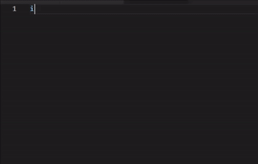

# Easy React Snippet


Easy React Snippet provides intuitive, easy-to-remember snippets for React development. Built with simplicity in mind, it offers commonly used React patterns without overwhelming you with too many options.

## Features

This extension provides essential react snippet code which are easy to recall and use, no overload nothing extra.
You don't need to remember even just use `hooks`, `comp` or `lcm` for a broad list.



## Installation

1. Open VS Code
2. Press `Ctrl+P` / `Cmd+P` to open the Quick Open dialog
3. Type `ext install ShishirSingh.easy-react-snippet`
4. Click install

## Usage

Type any of the following snippet prefixes and press `Tab` to expand them. You can also type broader categories like `hooks`, `comp`, or `lcm` to see all related snippets.

Example:

```javascript
// Type 'fcd' and press Tab
const ComponentName = () => {
    return (
        <div>
            
        </div>
    );
};

export default ComponentName;
```

## Snippets

| Snippet           | Expansion                                     |
| ----------------- | --------------------------------------------- |
| `im`              | Import Module                                 |
| `ir`              | Import React                                  |
| `irc`             | Import React & Component                      |
| `ird`             | Import ReactDOM                               |
| `irds`            | Import ReactDOMServer                         |
| `irdc`            | Import ReactDOMClient                         |
| `irs`             | Import React and useState                     |
| `ire`             | Import React and useEffect                    |
| `irse`            | Import React, useState and useEffect          |
| `is`              | Import useState                               |
| `ie`              | Import useEffect                              |
| `ccd`, `comp`     | Class Component default export                |
| `cccd`, `comp`    | Class Component w/ Constructor default export |
| `cc`, `comp`      | Class Component                               |
| `ccc`, `comp`     | Class Component w/ Constructor                |
| `fcd`, `comp`     | Function Component default export             |
| `fc`, `comp`      | Function Component                            |
| `ffcd`, `comp`    | Function Syntax Component default export      |
| `ffc`, `comp`     | Function Syntax Component                     |
| `us`, `hooks`     | useState Hook                                 |
| `ue`, `hooks`     | useEffect Hook                                |
| `uer`, `hooks`    | useEffect Hook with return                    |
| `uct`, `hooks`    | useContext Hook                               |
| `ur`, `hooks`     | useReducer Hook                               |
| `ucb`, `hooks`    | useCallback Hook                              |
| `ur`, `hooks`     | useRef Hook                                   |
| `udv`, `hooks`    | useDeferredValue Hook                         |
| `ut`, `hooks`     | useTransition Hook                            |
| `ui`, `hooks`     | useId Hook                                    |
| `cdm`, `lcm`      | componentDidMount LifeCycle Method            |
| `cwm`, `lcm`      | componentWillMount LifeCycle Method           |
| `cwrp`, `lcm`     | componentWillReceiveProps LifeCycle Method    |
| `gds`, `lcm`      | getDerivedStateFromProps LifeCycle Method     |
| `scu`, `lcm`      | shouldComponentUpdate LifeCycle Method        |
| `cwu`, `lcm`      | componentWillUpdate LifeCycle Method          |
| `cdu`, `lcm`      | componentDidUpdate LifeCycle Method           |
| `cwn`, `lcm`      | componentWillUnmount LifeCycle Method         |
| `cdc`, `lcm`      | componentDidCatch LifeCycle Method            |
| `gsbu`, `lcm`     | getSnapshotBeforeUpdate LifeCycle Method      |
| `ss`              | setState                                      |
| `ssf`             | Functional setState                           |
| `ren`             | render                                        |
| `renprop`, `comp` | Render Prop                                   |
| `hoc`, `comp`     | Higher Order Component                        |
| `cp`              | Context Provider                              |
| `cpf`             | Class Property Function                       |
| `lazy`            | React Lazy Import                             |
| `sus`             | React Suspense                                |

## Contributing

Feel free to open issues to suggest new snippets or improvements!
